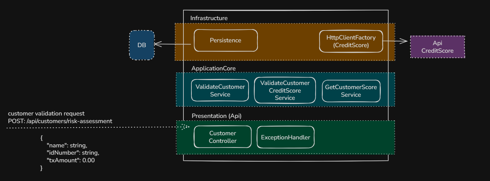
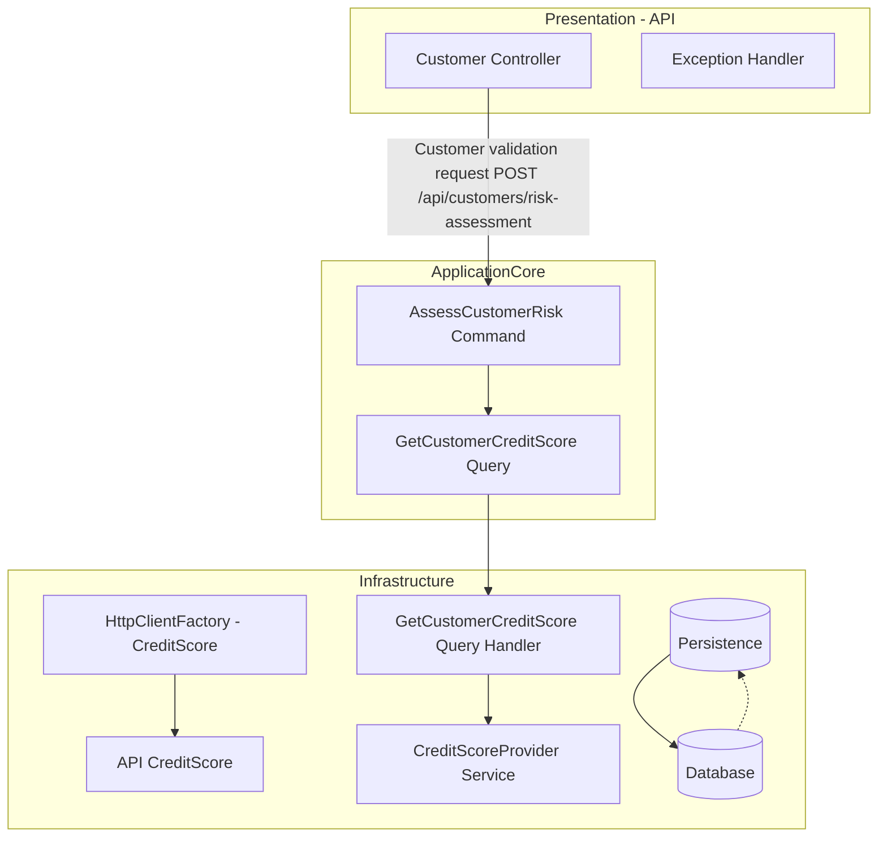

# Documentación de Arquitectura: Servicio de Validación de Riesgo

---



---

## 1. Arquitectura General

El sistema está diseñado con una arquitectura de **3 capas principales**, siguiendo buenas prácticas de separación de responsabilidades para facilitar mantenimiento, escalabilidad y pruebas.

| Capa                   | Descripción                                                                                                                       |
| ---------------------- | --------------------------------------------------------------------------------------------------------------------------------- |
| **Presentation (API)** | Expone endpoints REST para recibir solicitudes de validación de clientes. Contiene controladores y manejo de excepciones.         |
| **ApplicationCore**    | Contiene la lógica de negocio y casos de uso, como validación del cliente, obtención del score crediticio y evaluación de riesgo. |
| **Infrastructure**     | Implementa la integración con servicios externos (HttpClientFactory para el proveedor de CreditScore) y persistencia futura.      |

---

## 2. Flujo esperado

1. Un cliente envía una solicitud HTTP `POST` a `/api/customers/risk-assessment` con un payload JSON:

```json
{
  "name": "string",
  "idNumber": "string",
  "txAmount": 0.00
}
```

2. **Presentation (API)**: El controlador `CustomerController` recibe la petición, valida y despacha al servicio correspondiente.

3. **ApplicationCore**:

   * `ValidateCustomerService` valida al cliente.
   * `ValidateCustomerCreditScoreService` solicita el score crediticio.
   * `GetCustomerScoreService` obtiene el score desde el proveedor o cache.
   * Se aplica la lógica de negocio para evaluar el riesgo.

4. **Infrastructure**:

   * `HttpClientFactory (CreditScore)` realiza la consulta HTTP al API externo para obtener el score.
   * Persistencia (pendiente de implementar) para almacenar los datos del score y cachear consultas.

5. Finalmente, la respuesta con el estado de riesgo (`Approved` o `Rejected`) es enviada al cliente.

---

## 3. Estado actual vs esperado

| Componente             | Estado Actual                                              | Estado Esperado (Fases futuras)                                           |
| ---------------------- | ---------------------------------------------------------- | ------------------------------------------------------------------------- |
| **Presentation (API)** | Implementado con `CustomerController` y `ExceptionHandler` | Sin cambios significativos, mejoras en validación y logging               |
| **ApplicationCore**    | Servicios de validación y consulta de score implementados  | Inclusión de persistencia local y lógica de cache                         |
| **Infrastructure**     | HttpClientFactory configurado para consulta HTTP           | Persistencia en base de datos para scores, cache en memoria o distribuida |
| **Persistencia**       | No implementada                                            | Base de datos para almacenar snapshots de scores                          |
| **Cache**              | No implementada                                            | Cache temporal (aprox. 5 minutos) para evitar llamadas duplicadas         |

---

## 4. Diagrama Mermaid



---

## 5. Consideraciones adicionales

* El diagrama refleja claramente las responsabilidades y comunicación entre capas.
* La persistencia y cache son objetivos para las próximas fases para optimizar performance y evitar múltiples llamadas a la API externa.
* La arquitectura permite escalar y adaptar fácilmente la lógica de negocio y las integraciones.

---

Si quieres, puedo ayudarte a integrar esta documentación en un README completo o en documentación técnica con ejemplos y pautas para pruebas.
